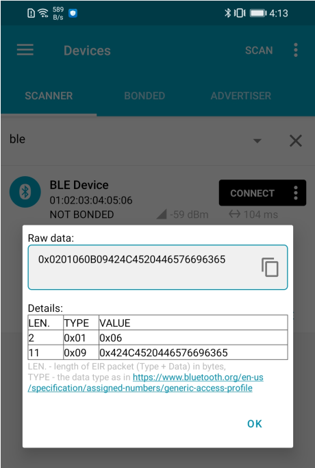

# GL-BLE-SDK     bleAdvertiser

Demonstrate how to broadcast

This is a demonstration of the user using gl-ble-api to send out a broadcast.


## Compile

Make sure you have the compile option enabled before compiling the project.

```
make menuconfig
-> gl-inet-ble
	-> {M} libglble.......................... GL inet BLE driver library
	-> <M> gl-bleAdvertiser........................................ GL inet BLE Advertiser
```


## Using the example

You can use SCP or other means to upload example ipk to the device.

### install

```shell
opkg install libglble_1.0.0_mipsel_24kc.ipk 
opkg install gl-bleAdvertiser_1.0.0_mipsel_24kc.ipk 
```

### Using

```shell
bleAdvertiser [phys:1] [interval_min:160] [interval_max:160] [discover:2] [adv_conn:2] [data0:NULL] [data1:NULL]
	-> phys: The PHY on which the advertising packets are transmitted on. Now only support LE 1M PHY.
				1: LE 1M PHY, 4: LE Coded PHY.
	-> interval_min : Minimum advertising interval. Value in units of 0.625 ms
                   			Range: 0x20 to 0xFFFF, Time range: 20 ms to 40.96 s.
	-> Maximum advertising interval. Value in units of 0.625 ms
                     		Range: 0x20 to 0xFFFF, Time range: 20 ms to 40.96 s.
	-> discover : Define the discoverable mode.
                     0: Not discoverable.
                     1: Discoverable using both limited and general discovery procedures.
                     2: Discoverable using general discovery procedure.
                     3: Device is not discoverable in either limited or generic discovery.
                         procedure, but may be discovered by using the Observation procedure
                     4: Send advertising and/or scan response data defined by the user.
                         The limited/general discoverable flags are defined by the user.
	-> adv_conn : Define the connectable mode.
                     0: Non-connectable non-scannable.
                     1: Directed connectable (RESERVED, DO NOT USE).
                     2: Undirected connectable scannable (This mode can only be used
                       in legacy advertising PDUs).
                     3: Undirected scannable (Non-connectable but responds to
                       scan requests).
                     4: Undirected connectable non-scannable. This mode can
                       only be used in extended advertising PDUs.
	-> data0 : Customized non-targeted advertising data. Must be hexadecimal ASCII. Like “020106”, Length <=31 characters.
  -> data1 : Customized scan response data. Must be hexadecimal ASCII. Like “020106”, Length <=31 characters.(Optional)
```

If you don't need to customize the parameters, you can use the default parameters.

```shell
root@GL-S1300:~# bleAdvertiser 
Broadcasting data, the mac of the current device is > 01:02:03:04:05:06
```



You can use **CTRL+C** or **CTRL+\\** to terminate the application.

